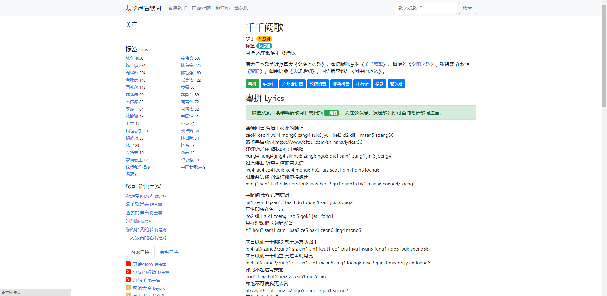
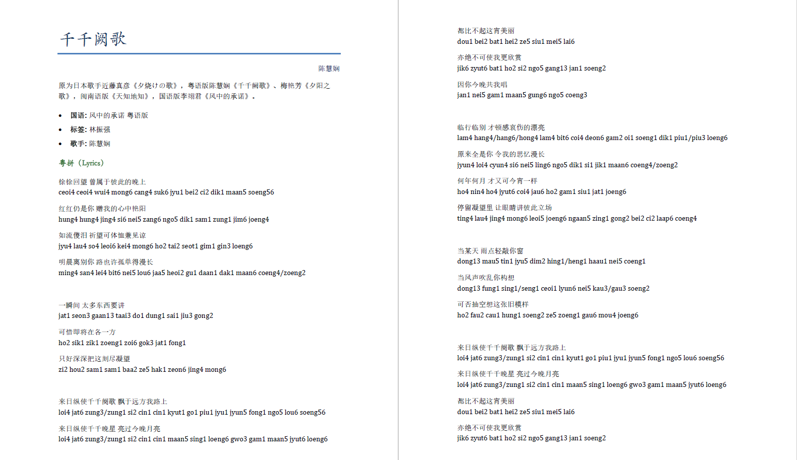
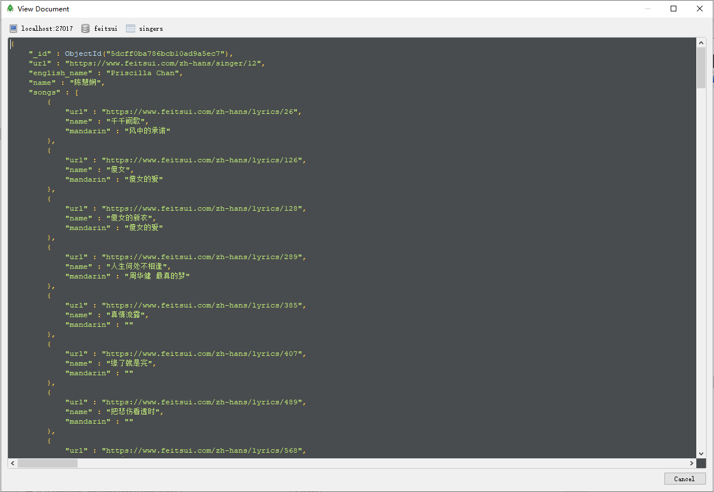
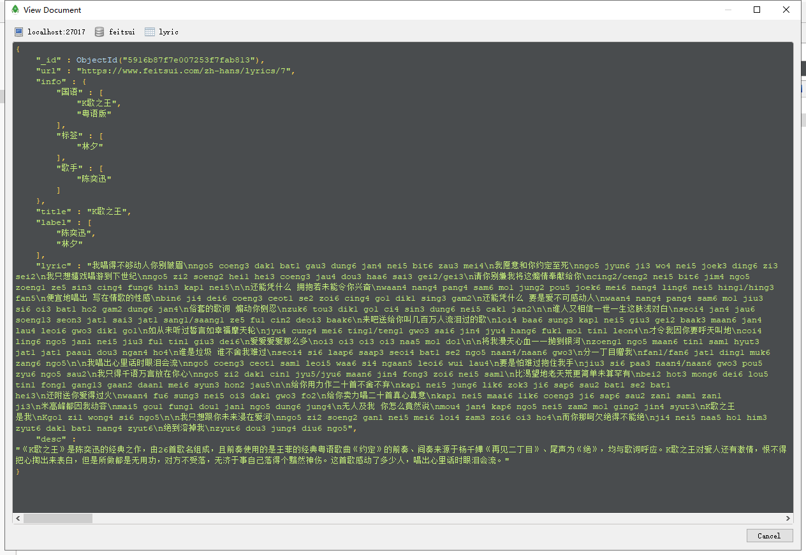
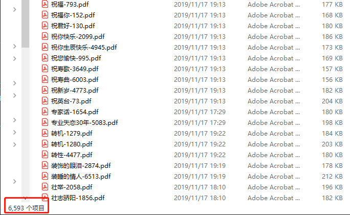

# Feitsui Downloader

 [翡翠粤语歌 (https://www.feitsui.com)](https://www.feitsui.com/) 词下载器，从翡翠粤语歌词网站下载粤语歌词，存储到MongoDB，并将歌词做成docx和pdf格式（方便有打印需求的人打印）。Just for fun :)

网站歌词如下：

下载制作PDF后效果如下：

# 0. 依赖
* MongoDB数据库，pymongo
* python-docx
* BeautifulSoup
* requests
* win32com

# 1. 歌词下载

依次运行`code/spider.py`脚本中注释的3部分,分别爬取**全部歌手信息**、**每位歌手的歌单信息**、**每首歌的歌词**，存入MongoDB。MongoDB中只有两个`Collection`，分别是`singers`和`lyric`，分别存储歌手信息和歌词信息，如下图。

歌手样例

歌词样例

# 2. 生成docx然后转换pdf

1) 运行`code/gen_doc.py`生成`docx`格式的歌词文件,存储在`lyrics`目录下。
2) 运行`code/docx2pdf.py`将`docx`格式的文件转换成`pdf`格式的文件,存储在`pdf`目录下。

# 3. 结果

* 最后收集到`6593`首粤语歌词（带有粤拼）。
* `feitsui_dump`目录下是已经爬取好并导出的MongoDB文件，为避免再次下载，可通过`mongorestore -d feitsui feitsui_dump/feitsui`直接导入到MongoDB中使用。

# 4. 其它

* 另外一个粤拼歌词网站: [https://jyut6.com/](https://jyut6.com/)。

**原网站歌词制作者制作歌词不易，歌词请勿滥用及个人获利。如有侵权，请联系删除。`yqqbeyond at gmail.com`**

